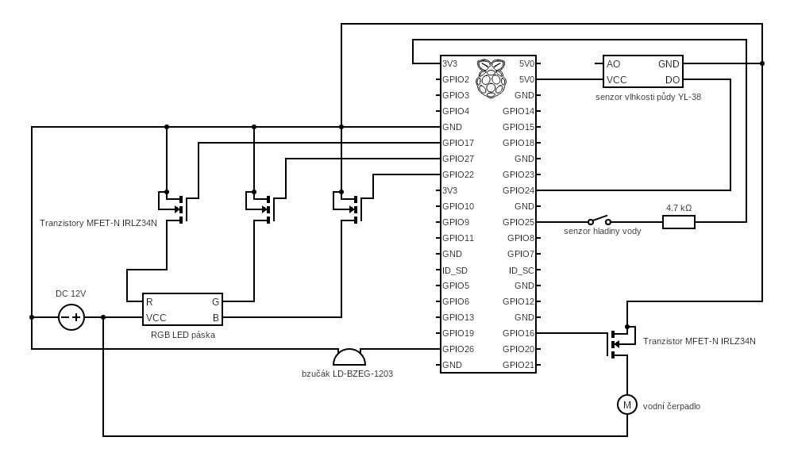

# Chytra domacnost

Tento projekt vznikl jako semestralni prace do predmetu NI-IOT na CVUT v Praze.

V projektu bych chtel vytvorit:
- system pro automaticke zalevani kvetiny se senzorem vlhkosti pudy a senzorem hladiny vody v nadrzi, aby se hlidalo, ze voda dosla
- rozsveceni a nastavovani barvy pasu LED diod

Projekt bude postaveny na zarizeni Raspberry Pi 3B. Na zarizeni pobezi webovy server, ktery bude zobrazovat informace a bude z nej mozne ovladat pripojene soucastky. Server i ovladani bude napsany v Jave.

Schema zapojeni soucastek do Raspberry:

